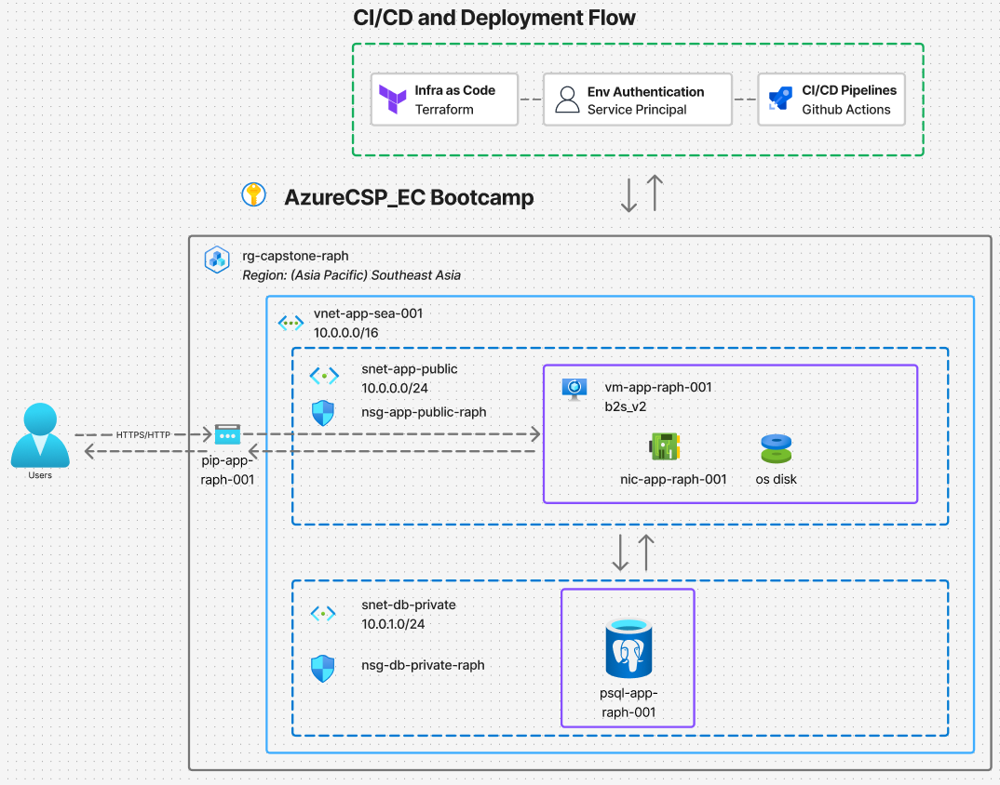

# Infra Design Bootcamp Milestone — Azure Single-VM Deployment via Terraform + GitHub Actions

A complete infrastructure-as-code deployment on Azure: a single VM serving nginx, a private managed PostgreSQL database, with a CI/CD pipeline.

---

## Architecture



**User Request flow:** Users → HTTPS/HTTP → Public IP (`pip-app-raph-001`) → NSG filter → VM (`vm-app-raph-001`, nginx) → private DNS → PostgreSQL (`psql-app-raph-001`) on port 5432.

| Resource | Name | Purpose |
|---|---|---|
| Resource group | `rg-capstone-raph` | All application infrastructure (Southeast Asia) |
| Virtual network | `vnet-app-sea-001` (10.0.0.0/16) | Network boundary |
| App subnet | `snet-app-public` (10.0.0.0/24) | Hosts the VM; internet-reachable |
| DB subnet | `snet-db-private` (10.0.1.0/24) | Delegated to PostgreSQL Flexible Server; no internet exposure |
| NSG (app) | `nsg-app-public-raph` | 80/443 from anywhere; 22 from admin IP **only** |
| NSG (db) | `nsg-db-private-raph` | 5432 from the app subnet (10.0.0.0/24) **only** |
| Public IP | `pip-app-raph-001` | Static; the users' entry point |
| VM | `vm-app-raph-001` (B2s v2, Ubuntu 24.04) | nginx + app content |
| PostgreSQL | `psql-app-raph-001` (Burstable, B1ms) | Private access only, in the delegated subnet with a private DNS zone |

A second resource group, `rg-capstone-backend-raph`, holds the Terraform state storage account (`straphtfstate001`).

---

### Network security (NSG rules)
 
Each subnet has a Network Security Group attached — Azure's firewall layer. The rules below are the complete inbound policy; anything not explicitly allowed is denied by Azure's default rules.
 
**`nsg-app-public-raph`** (on `snet-app-public`, where the VM lives):
 
| Priority | Port | Protocol | Allowed from | Purpose |
|---|---|---|---|---|
| 100 | 443 | TCP | Anywhere | HTTPS — the public website |
| 110 | 80 | TCP | Anywhere | HTTP — the public website |
| 120 | 22 | TCP | Admin IP only (`/32`) | SSH — administrative access |
| — | everything else | — | **Denied** | Azure default deny |
 
**`nsg-db-private-raph`** (on `snet-db-private`, where PostgreSQL lives):
 
| Priority | Port | Protocol | Allowed from | Purpose |
|---|---|---|---|---|
| 100 | 5432 | TCP | App subnet only (`10.0.0.0/24`) | PostgreSQL — the VM is the only permitted client |
| — | everything else | — | **Denied** | Azure default deny |

 
---

## Repository structure

```
.
├── .github/workflows/
│   └── terraform-pipeline.yml   # plan on PR, apply on merge to main
├── app/                         # application content
├── terraform/
│   ├── backend.tf               # remote state configuration (azurerm backend)
│   ├── provider.tf              # pinned terraform + azurerm versions
│   ├── variables.tf             # secret/environment-specific inputs only
│   ├── main.tf                  # resource group
│   ├── network.tf               # vnet, subnets
│   ├── nsg.tf                   # security rules + subnet associations
│   ├── vm.tf                    # public IP, NIC, VM setup
│   ├── database.tf              # private DNS zone + PostgreSQL Flexible Server
│   └── cloud-init.yaml          # first-boot config: nginx install + page
└── README.md
```

---
## Getting Started
Cloning this repo is not enough by itself — the state backend, credentials, and secrets are deliberately **not** in the repository. To stand up your own copy:
 
**Prerequisites:** an Azure subscription, Azure CLI (`az`), Terraform ≥ 1.5, and a GitHub account. All commands assume a Linux shell (WSL works).
 
**1. Fork/clone the repo** and log in to Azure:
 
```bash
az login
az account show -o table    # confirm the right subscription is active
```
 
**2. Create your own state backend** (see the one-time bootstrap below.) Then update `terraform/backend.tf` to match.
 
**3. Create your inputs.** Generate an SSH key pair and write your local `terraform/terraform.tfvars` (gitignored)
 
```bash
ssh-keygen -t ed25519 -f ~/.ssh/vm-capstone -C "vm-admin"
```
 
```hcl
# terraform/terraform.tfvars
admin_source_ip   = "<your-public-ip>/32"                  # curl -s ifconfig.me
db_admin_password = "<strong-password-16+chars>"
vm_ssh_public_key = "<contents of ~/.ssh/vm-capstone.pub>"
```
 
**4. First, deploy locally, to verify everything works before wiring CI:**
 
```bash
cd terraform
terraform init
terraform plan     
terraform apply
```
 
The apply prints `vm_public_ip` — open `http://<that-ip>` in a browser. You should see the page.
 
**5. Wire up the pipeline.** Create an Azure service principal and add **seven GitHub repository secrets** (Settings → Secrets and variables → Actions):
 
| Secret | Value |
|---|---|
| `AZURE_CLIENT_ID` | the service principal's appId |
| `AZURE_CLIENT_SECRET` | its client secret |
| `AZURE_TENANT_ID` | your tenant ID |
| `AZURE_SUBSCRIPTION_ID` | your subscription ID |
| `TF_VAR_admin_source_ip` | same value as in your tfvars |
| `TF_VAR_db_admin_password` | same value as in your tfvars |
| `TF_VAR_vm_ssh_public_key` | same value as in your tfvars |
 
The service principal needs at least **Contributor** on the app resource group and data access to the state storage account.

**6. Protect `main`** require a pull request and require the `plan` status check to pass before merging.

---

## One-time bootstrap (manual step)


Terraform needs somewhere to store its state *before* it can manage anything. The state backend is therefore created once with the Azure CLI and never touched again:

```bash
az group create --name rg-capstone-backend-raph --location southeastasia

az storage account create \
  --name straphtfstate001 \
  --resource-group rg-capstone-backend-raph \
  --location southeastasia \
  --sku Standard_LRS

az storage container create \
  --name tfstate \
  --account-name straphtfstate001 \
  --auth-mode login
```

---

## CI/CD pipeline

One workflow (`terraform-pipeline.yml`) has two jobs modeled on the standard test→deploy pattern:

| Job | Trigger | Purpose |
|---|---|---|
| `plan` | every PR and every push to `main` | Code reviewer sees exactly what would change in Azure before merge |
| `apply` | push to `main` only, and only if `plan` succeeded (`needs: plan`) | Executes the reviewed change |

**Merging is the approval.** Branch protection on `main` requires the plan check to pass (and a PR) before merge is possible, so an unreviewed or failing plan cannot deploy.

**Env Authentication:** a bootcamp-provided Azure service principal using a client secret, supplied to the workflow via GitHub repository secrets. Terraform input variables that cannot live in the repo (admin IP, DB password, SSH public key) are injected as `TF_VAR_*` secrets and Github Secrets.

---

## Design decisions

**VM sizing: Standard_B2s_v2 (2 vCPU, 8 GB, burstable).** The burstable (B-series) family matches the workload shape. A web server with ≤50 concurrent users is fit in a low CPU baseline plus burst credits. The same burstable reasoning applies to the database tier (B1ms), and the VM's OS disk uses Standard_LRS because it serves only the OS and static content.

**Managed PostgreSQL instead of a database on the VM.** The brief lists "single VM" and "single DB" as separate constraints. The PSQL managed service provides automated backups, patching, and resource isolation for ~USD 20/month.

**Private-only database.** The Flexible Server runs in VNet-integrated mode in a delegated subnet with a private DNS zone. It has no public endpoint from outside the VNet. Access is doubly restricted: Resides in a private subnet plus an NSG rule allowing 5432 only from the app subnet.

**NSG rules.** The NSGs (Azure's firewall layer) define three inbound rules:
 
- **Ports 80/443 (the website):** accept connections from any IP address. This is for public so anyone should be able to load the site.
- **Port 22 (SSH — remote terminal access to the VM):** accepts connections from the administrator's IP address, and through SSH keys only.
- **Port 5432 (PostgreSQL):** accepts connections only from the app subnet (10.0.0.0/24) — i.e., only the VM. Users never talk to the database directly.

**No NAT gateway.** Evaluated but rejected. The VM already has its own PIP attached to the NIC which serves both inbound and outbound traffic, and the managed PostgreSQL service handles its own connectivity. Adding one (~USD 32+/month) would spend budget on a problem this architecture doesn't have.

**Secrets hygiene.** State files and `terraform.tfvars` are gitignored.

---

## Verification evidence

**PSQL Network isolation**

```
# from inside the VM (app subnet):
nc -zv psql-app-raph-001.postgres.database.azure.com 5432
→ Connection to ... (10.0.1.4) 5432 port [tcp/postgresql] succeeded!

# from outside the VNet (laptop):
nc -zv psql-app-raph-001.postgres.database.azure.com 5432
→ Name or service not known        # the DB hostname doesn't even resolve externally
```


**Destroy-and-rebuild (reliability proof).** The complete environment was destroyed and rebuilt exclusively through the pipeline (PR → plan showing to add → merge → apply). The rebuilt environment passed all the same verification tests. The state backend survived as designed.

**CI/CD gating.** On PRs, the apply job shows as *skipped* while plan runs; on merge, both execute. Branch protection blocks merging on a failed plan.

---

## Cost justification


Burstable tiers (B-series) fit the workload: ≤50 concurrent users with idle-heavy traffic. Cost is well below the ~200 USD budget which saves a lot.

---

## Known limitations & production next steps

- **HTTP only (no TLS to users).** Certificates require a DNS name; this deployment has only a bare IP, which changes on rebuild.
- **Out of scope per brief:** multi-region/HA, auth/SSO, production monitoring/SLOs, model fine-tuning.
---

## Runbook

| Task | How |
|---|---|
| Change infrastructure | Edit `terraform/`, branch → PR (review the plan) → merge |
| Change app content | Edit `cloud-init.yaml`, same flow (expect VM replacement and new SSH host key) |
| Rebuild everything | `terraform destroy`, then merge any change — the pipeline restores the world |
| Change the DB password | Update the GitHub secret `TF_VAR_db_admin_password` *and* local `terraform.tfvars`, then apply |
