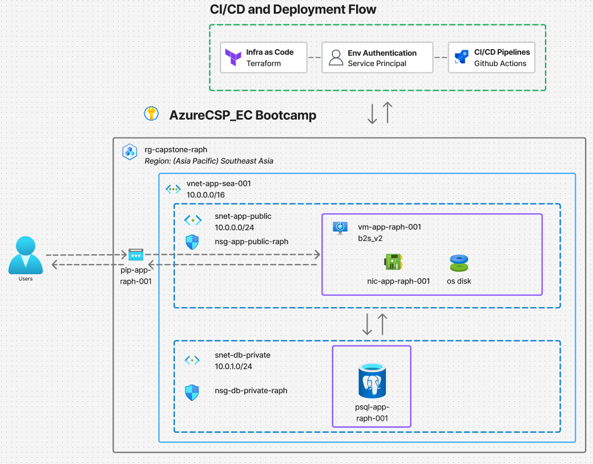
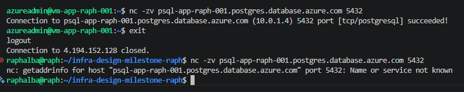
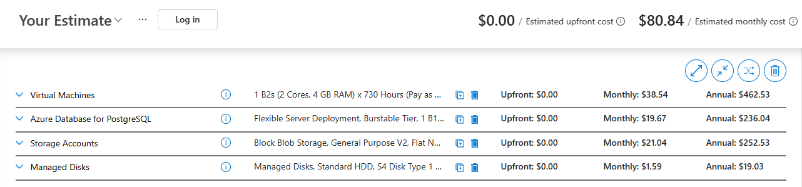

# Infra Design Bootcamp Milestone — Azure Single-VM Deployment via Terraform + GitHub Actions

A complete infrastructure-as-code deployment on Azure: a single VM serving nginx, a private managed PostgreSQL database, with a CI/CD pipeline.

---

## Architecture



**User Request flow:** Users → HTTPS/HTTP → Public IP (`pip-app-raph-001`) → NSG filter → VM (`vm-app-raph-001`, nginx) → private DNS → PostgreSQL (`psql-app-raph-001`) on port 5432.

| Resource | Name | Purpose |
|---|---|---|
| Resource group | `rg-capstone-raph` | All application infrastructure (Southeast Asia) |
| Virtual network | `vnet-app-sea-001` (10.0.0.0/16) | Network boundary |
| App subnet | `snet-app-public` (10.0.0.0/24) | Hosts the VM; internet-reachable |
| DB subnet | `snet-db-private` (10.0.1.0/24) | Delegated to PostgreSQL Flexible Server; no internet exposure |
| NSG (app) | `nsg-app-public-raph` | 80/443 from anywhere; 22 from admin IP **only** |
| NSG (db) | `nsg-db-private-raph` | 5432 from the app subnet (10.0.0.0/24) **only** |
| Public IP | `pip-app-raph-001` | Static; the users' entry point |
| VM | `vm-app-raph-001` (B2s v2, Ubuntu 24.04) | nginx + app content |
| PostgreSQL | `psql-app-raph-001` (Burstable, B1ms) | Private access only, in the delegated subnet with a private DNS zone |

A second resource group, `rg-capstone-backend-raph`, holds the Terraform state storage account (`straphtfstate001`).

---

## Repository structure

```
.
├── .github/workflows/
│   └── terraform-pipeline.yml   # plan on PR, apply on merge to main
├── app/                         # application content
├── terraform/
│   ├── backend.tf               # remote state configuration (azurerm backend)
│   ├── provider.tf              # pinned terraform + azurerm versions
│   ├── variables.tf             # secret/environment-specific inputs only
│   ├── main.tf                  # resource group
│   ├── network.tf               # vnet, subnets
│   ├── nsg.tf                   # security rules + subnet associations
│   ├── vm.tf                    # public IP, NIC, VM setup
│   ├── database.tf              # private DNS zone + PostgreSQL Flexible Server
│   └── cloud-init.yaml          # first-boot config: nginx install + page
└── README.md
```

---

## One-time bootstrap (manual step)

Terraform needs somewhere to store its state *before* it can manage anything. The state backend is therefore created once with the Azure CLI and never touched again:

```bash
az group create --name rg-capstone-backend-raph --location southeastasia

az storage account create \
  --name straphtfstate001 \
  --resource-group rg-capstone-backend-raph \
  --location southeastasia \
  --sku Standard_LRS

az storage container create \
  --name tfstate \
  --account-name straphtfstate001 \
  --auth-mode login
```

---

## CI/CD pipeline

One workflow (`terraform-pipeline.yml`) has two jobs modeled on the standard test→deploy pattern:

| Job | Trigger | Purpose |
|---|---|---|
| `plan` | every PR and every push to `main` | Code reviewer sees exactly what would change in Azure before merge |
| `apply` | push to `main` only, and only if `plan` succeeded (`needs: plan`) | Executes the reviewed change |

**Merging is the approval.** Branch protection on `main` requires the plan check to pass (and a PR) before merge is possible, so an unreviewed or failing plan cannot deploy.

**Env Authentication:** a bootcamp-provided Azure service principal using a client secret, supplied to the workflow via GitHub repository secrets. Terraform input variables that cannot live in the repo (admin IP, DB password, SSH public key) are injected as `TF_VAR_*` secrets.


---

## Design decisions

**Managed PostgreSQL instead of a database on the VM.** The brief lists "single VM" and "single DB" as separate constraints, signaling two resources. The managed service provides automated backups, patching, and resource isolation for ~USD 15–25/month — responsibilities that would otherwise fall on a single unmonitored VM. The VM is the stateless, rebuildable tier; the database is the stateful tier on infrastructure designed to protect state.

**Private-only database.** The Flexible Server runs in VNet-integrated mode in a delegated subnet with a private DNS zone. It has no public endpoint from outside the VNet. Access is doubly restricted: Resides in a private subnet plus an NSG rule allowing 5432 only from the app subnet.

**NSG rules** The NSGs (Azure's firewall layer) define three inbound rules:
 
- **Ports 80/443 (the website):** accept connections from any IP address. This is for public so anyone should be able to load the site.
- **Port 22 (SSH — remote terminal access to the VM):** accepts connections from the administrator's IP address, and through SSH keys only.
- **Port 5432 (PostgreSQL):** accepts connections only from the app subnet (10.0.0.0/24) — i.e., only the VM. Users never talk to the database directly.

**No NAT gateway.** Evaluated but rejected. The VM already has its own PIP attached to the NIC which serves both inbound and outbound traffic, and the managed PostgreSQL service handles its own connectivity. Adding one (~USD 32+/month) would spend budget on a problem this architecture doesn't have.

**Service principal with client secret; OIDC attempted.** OIDC federation (no stored secrets) was attempted on the provided service principal but blocked by tenant permissions on the app registration. Client-secret auth is used with the secret stored only in GitHub repository secrets. In production, OIDC federation would be the first improvement. *Observation:* the provided SP holds Owner at subscription scope; least-privilege would scope Contributor to `rg-capstone-raph` only.

**Secrets hygiene.** State files and `terraform.tfvars` are gitignored.

---

## Verification evidence

**PSQL Network isolation**

```
# from inside the VM (app subnet):
nc -zv psql-app-raph-001.postgres.database.azure.com 5432
→ Connection to ... (10.0.1.4) 5432 port [tcp/postgresql] succeeded!

# from outside the VNet (laptop):
nc -zv psql-app-raph-001.postgres.database.azure.com 5432
→ Name or service not known        # the DB hostname doesn't even resolve externally
```




**Destroy-and-rebuild (reliability proof).** The complete environment was destroyed (`terraform destroy`, ~14 resources) and rebuilt exclusively through the pipeline (PR → plan showing 14 to add → merge → apply). The rebuilt environment passed all the same verification tests. The state backend survived as designed.

**CI/CD gating.** On PRs, the apply job shows as *skipped* while plan runs; on merge, both execute. Branch protection blocks merging on a failed plan.

---

## Cost justification



Burstable tiers (B-series) fit the workload: ≤50 concurrent users with idle-heavy traffic. Cost is well below the ~200 USD budget which saves a lot.

---

## Known limitations & production next steps

- **HTTP only (no TLS to users).** Certificates require a DNS name; this deployment has only a bare IP, which changes on rebuild.
- **Out of scope per brief:** multi-region/HA, auth/SSO, production monitoring/SLOs, model fine-tuning.
- **Any content change replaces the VM.** Application content is currently baked into cloud-init.yaml, which runs only on a VM's first boot — so even a one-line HTML edit forces Terraform to destroy and recreate the VM.
---

## Runbook

| Task | How |
|---|---|
| Change infrastructure | Edit `terraform/`, branch → PR (review the plan) → merge |
| Change app content | Edit `cloud-init.yaml`, same flow (expect VM replacement and new SSH host key) |
| Rebuild everything | `terraform destroy`, then merge any change — the pipeline restores the world |
| Change the DB password | Update the GitHub secret `TF_VAR_db_admin_password` *and* local `terraform.tfvars`, then apply |